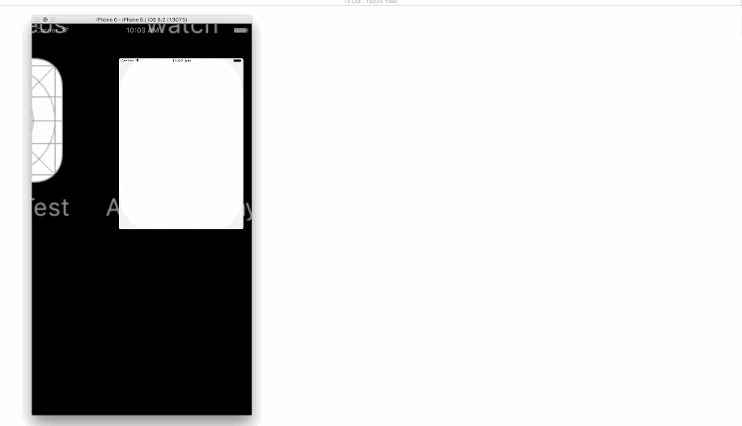

# Airplay-Display
A simple project demonstrating the use of multiple UIScreens to display separate view controllers for an iOS device and remote screen(Airplay).

## Without a Second Screen

## With a Second Screen

